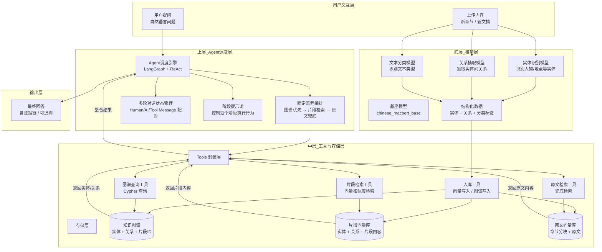

novelAgent/                          # 项目根目录
├── scrapy.cfg                      # ✅ Scrapy配置（放在根目录）
├── requirements.txt                # 项目依赖
├── README.md                       # 项目说明
├── src/                            # 源代码目录
│   ├── __init__.py
│   ├── crawlers/                   # 爬虫模块
│   │   ├── __init__.py
│   │   ├── spiders/                # Scrapy spiders
│   │   │   ├── __init__.py
│   │   │   ├── novel_spider.py     # 小说爬虫
│   │   │   └── base_spider.py      # 基础爬虫类
│   │   ├── pipelines.py            # 数据管道
│   │   └── middlewares.py          # 中间件
│   ├── ai_agent/                   # AI智能体模块
│   │   ├── __init__.py
│   │   ├── api/                    # 前端API
│   │   ├── models/                 # 模型应用
│   │   └── agent_system.py         # agent启动
│   ├── frontend/                   # 前端页面
│   │   ├── __init__.py
│   │   ├── static/                 # 静态文件
│   │   ├── index.html              # 前端页面 
│   ├── models/                     # 模型训练
│   │   ├── __init__.py
│   │   ├── inference/              # 模型推理
│   │   ├── LLM/                    # LLM工具调用
│   │   ├── registry/               # 模型配置
│   │   └── training/               # 模型推理
│   │   └── util/                   # 模型评估
│   ├── service/                    # 章节服务
│   │   ├── __init__.py
│   │   ├── chapter_processor.py    # 上传章节推理
│   │   └── chapter_storage.py      # 上传章节入库
│   ├── tools/                      # 模型工具
│   │   ├── __init__.py
│   │   ├── langchain_tools/        # 模型工具
│   │   ├── retrieval/              # 数据检索
│   │   ├── storage/                # 数据入库
│   │   └── utils.py                # 数据工具
│   └── utils/                      # 工具函数
│       ├── __init__.py
│       ├── file_utils.py           # 文件管理
│       └── config.py               # 配置管理
├── data/                           # 数据目录
│   ├── raw/                        # 原始数据
│   ├── processed/                  # 处理后的数据
│   │   ├── splits/                 # 模型推理后数据 
│   ├── vector_databases/           # 向量数据库存储 
│   └── models/                     # 训练好的模型
└──     ├── person_recognition_macBert/            # 实体识别模型
        ├── relation_recognition_macBert/          # 关系抽取模型
        └── shared/                                 # 模型基座
        └── text_recognition_macBert/              # 文本分类模型

## 系统架构图

系统采用五层架构设计，包含离线内容上传链路与在线问答链路两条主要数据流：

